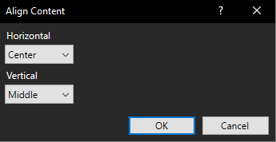

# Align Content

A Paint.NET plugin that moves the contents of a layer to a position you
choose. Center something on the canvas in one click instead of nudging it
with the arrow keys and hoping.

## Install

1. Download `Align.zip` from the
   [latest release](../../releases/latest).
2. Extract it.
3. Close Paint.NET.
4. Right click `Install_Align.bat` and choose **Run as administrator**.
5. Start Paint.NET.

The plugin appears under **Effects > Align > Align Content**.

If you would rather install it by hand, copy `Align.dll` into
`C:\Program Files\paint.net\Effects\` and restart Paint.NET.

Requires Paint.NET 5.1 or newer.

## Use

Pick a horizontal position, pick a vertical position, click OK.

| Horizontal | Vertical |
| --- | --- |
| Left | Top |
| Center | Middle |
| Right | Bottom |
| Leave as is | Leave as is |

"Leave as is" holds that axis in place, so you can center something
horizontally without moving it up or down.

With no selection active, content is positioned against the canvas. With a
selection active, it is positioned against the selection instead.

## What it moves

The plugin finds the smallest rectangle containing every visible pixel on
the current layer, and moves that. Drawings, pasted images and text all work
the same way, because Paint.NET turns text into pixels as soon as you commit
it.

## Limits

Worth knowing before you file a bug:

- **One layer at a time.** Paint.NET effects only see the active layer.
  Aligning several layers as a group is not possible with an effect plugin.
- **Opaque layers have nothing to move.** If every pixel is filled, the
  content already fills the canvas and there is nowhere to go. Draw on a
  transparent layer instead.
- **Selections clip the result.** Paint.NET only lets an effect write inside
  the current selection, so content moved outside one is cut off.

## Build from source

`Align.cs` is a [CodeLab](https://boltbait.com/pdn/codelab) script.

1. Install CodeLab.
2. In Paint.NET, open **Effects > Advanced > CodeLab**.
3. **File > Open** and choose `Align.cs`.
4. **Ctrl+P** to preview, **Build** to produce the DLL.

It uses the modern Bitmap effect pipeline introduced in Paint.NET 5.0, not
the older classic pipeline that most tutorials still cover.

## License

MIT
